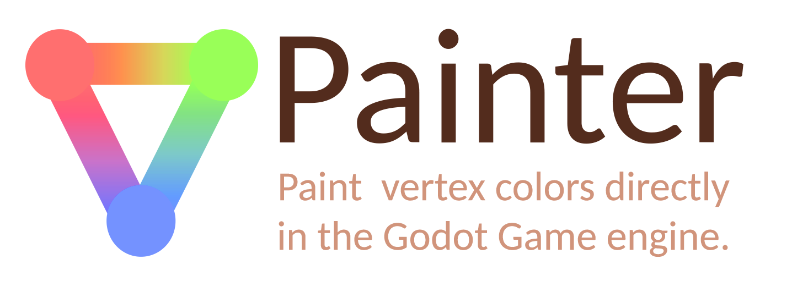
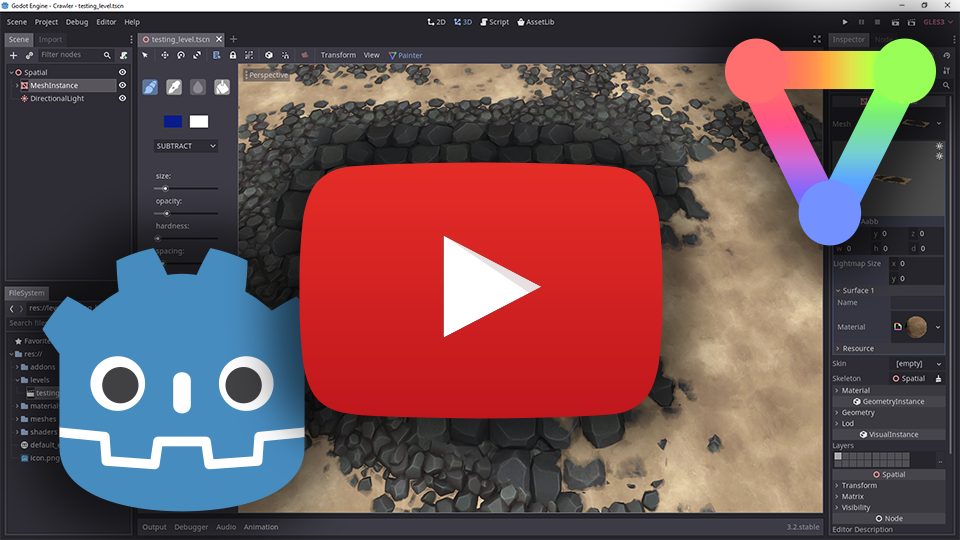
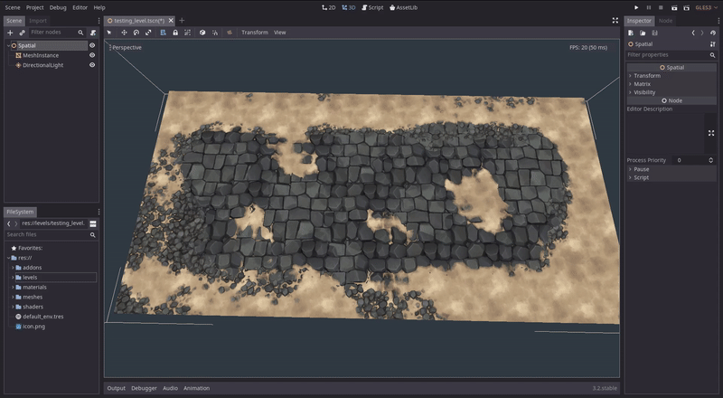
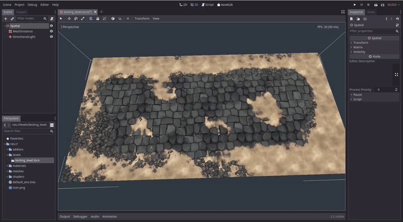
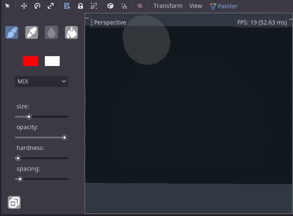

# A vertex painting addon for the Godot game engine.

  
  

  
# **DOWNLOAD AND INSTALL:**  
Download the addon from https://github.com/tomankirilov/VPainter.
Copy the addons folder in your project directory.  
In **Project/Project Settings/Plugins** set VPainter to Active.
  
  

  
  
# **USING THE PLUGIN:**  

  
In the 3d editor when a MeshInstance node with a valid mesh resource is selected an icon will appear in the top editor menu.  
When clicked a new sidebar will appear with painting options.

# **TOOLS:**  
   
**brush tool** : (Shortcut - "1") use to paint vertex colors. You can adjust the size with the sliders or by using "[" and "]"  
**picker tool**: (Shortcut - "2") use to pick the vertex color under the mouse cursor when clicked.  
**blur tool**  : (shortcut - "3") in progress  
**fill tool**  : (shortcut - "4") use to fill the entire mesh with a color. Fill tool is affected by the opacity and blend mode.    

**color swatches**: There are two color swatches. in the main panel. When clicked they reveal a color picker dialog. The last one clicked is the active one.  

**blending modes**: There are currently 5 blending modes supported:  
 * **MIX**: linearly interpolated between the colors.  
 * **ADD**: adds the colors.  
 * **SUBTRACT**: subtracts the colors.  
 * **MULTIPLY**: multiplies the colors.  
 * **DIVIDE**: divides the colors.  

**size**: controls the size of the brush and blur tool.  
**opacity**: controls the opacity of the brush and fill tool.  
**hardness**: controls the hardness of the brush and blur tool.  
**spacing** : controls the spacing between the brush "dabs". Lower spacing results in a more precise line.

**make local copy** : makes a local copy of the mesh. It is useful if you don't want to overwrite your original mesh data.  

# **LIMITATIONS:**
* Currently Vpainter does not support godot's primitive meshes. It only works with imported meshes.  
* Currently only RGB painting is supported. Alpha channel painting is in the works.
* Currently Vpainter does not support meshes with multiple instances of floating geometry.

# **ADDITIONAL RESOURCES:**  
In **VPainter/addons/vpainter/additional_resources/** you will find two shaders:  
* **shader_vertex_color.shader**:  
A simple shader that displays the vertex color. It has the possibility to isolate R, G and B channels so you can preview them individually.  
* **height_blend_4_textures.shader**:  
A shader used in the first presentation. It is used for mixing 4 textures based on a heightmap and vertex color.     
The shader uses 3 textures per material:  
	* **M**: A mask texture.  
		R channel contains the height information  
		G channel contains the rougness information  
		B channel contains the metal information.  
	* **C**: RGB color/albedo information.  
	* **N**: Normalmap information.  
# **SOURCES:**  
* The height blend shader was made after this amazing post:
http://untitledgam.es/2017/01/height-blending-shader/

