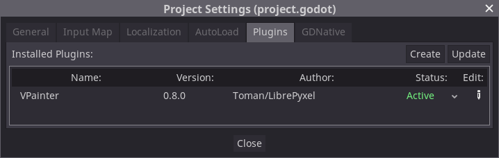
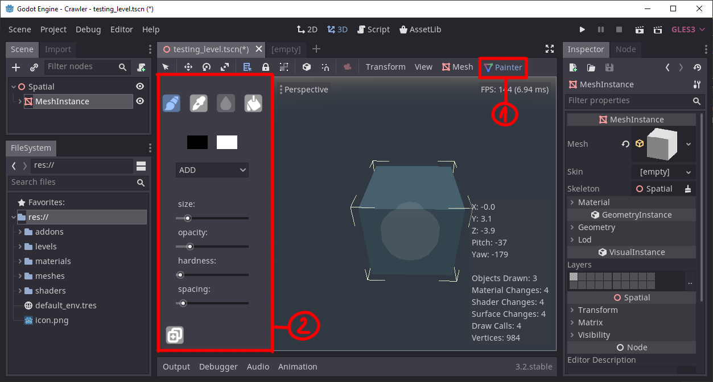

# A vertex painting addon for the Godot game engine.
  
  

  
**DOWNLOAD AND INSTALL:**  
Download the addon from https://github.com/tomankirilov/VPainter.
Copy the addons folder in your project directory.  
In **Project/Project Settings/Plugins** set VPainter to Active.
  
  

  
  
**USING THE PLUGIN:**  

  
In the 3d editor when a MeshInstance node with a valid mesh resource is selected an icon will appear in the top editor menu (1).  
When clicked a new sidebar will appear with painting options(2).

**TOOLS:**  
**brush tool** : (Shortcut - "1") use to paint vertex colors. You can adjust the size with the sliders or by using "[" and "]"  
  
**picker tool**: (Shortcut - "2") use to pick the vertex color  
**blur tool**  : (shortcut - "3") in progress  
**fill tool**  : (shortcut - "4") use to fill the entire mesh with a color.  
  
  
**ADDITIONAL RESOURCES:**  
In **VPainter/addons/vpainter/additional_resources/** you will find two shaders:  
**shader_vertex_color.shader** - is a simple shader that displays the vertex color. It has the possibility to isolate R, G and B channels so you can preview them individually.
**height_blend_4_textures.shader** - is a shader used in the first presentation. It is used for mixing 4 textures based on a heightmap and vertex color.     
The shader uses 3 textures per material:  
	* **M**: A mask texture. R channel contains the height information, G channel contains the rougness information and B channel contains the metal information.  
	* **C**: RGB color/albedo information.  
	* **N**: Normalmap information.  
